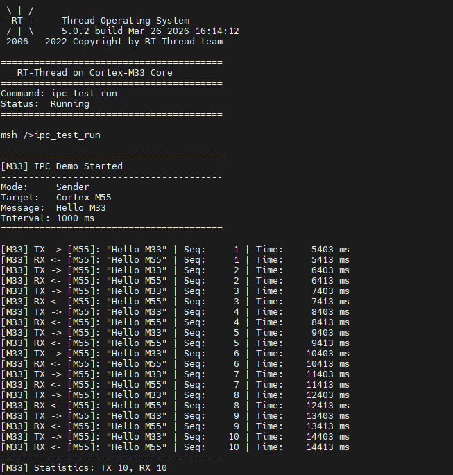
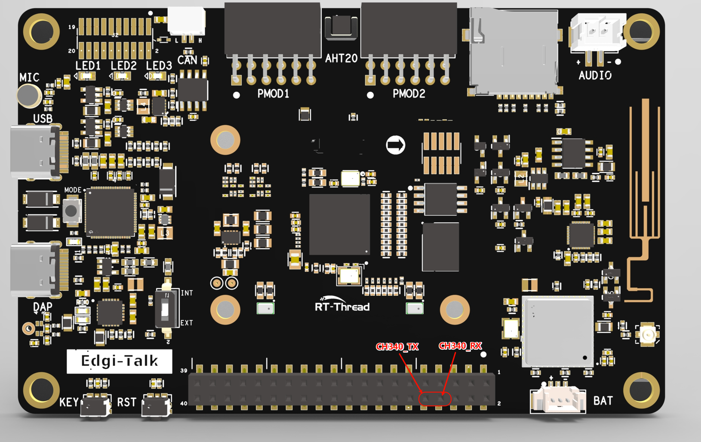

# Edgi_Talk_M33_IPC Dual-Core Communication Example Project

[**中文**](./README_zh.md) | **English**

## Overview

This project implements **IPC (Inter-Processor Communication)** dual-core communication on the **Edgi-Talk M33 core**, demonstrating message passing between **Cortex-M33** and **Cortex-M55**.

M33 acts as the **sender**, periodically sending "Hello M33" messages to M55 and receiving "Hello M55" replies.

## Default Configuration

* Communication frequency: 1000ms
* Message format: ASCII encoded text messages
* Uses Infineon PSoC E84 on-chip IPC Pipe hardware

## Build and Flash

1. Build the project using RT-Thread Studio or SCons.
2. Flash firmware to M33 core via KitProg3 (DAP).
3. Both M33 and M55 projects must be built and flashed for dual-core communication.
4. Connect serial port to view communication logs as shown below:



## Important Notes

### Serial Connection

This project uses **UART5** as the debug serial port. An external **CH340 USB-to-Serial module** is required:

* **Serial Port**: UART5
* **Baud Rate**: 115200
* **Data Bits**: 8
* **Stop Bits**: 1
* **Parity**: None

### CH340 Module Connection

Connect the CH340 module to the development board as follows:

**Connection Diagram**:



> ⚠️ **Important Notes**:
> 1. TX and RX must be cross-connected (CH340 TX to board RX)
> 2. Ensure GND is common between both devices

## Usage

### 1. Configuration and Build

Open in RT-Thread Studio:

```
RT-Thread Settings -> Hardware Drivers Config -> On-chip Peripheral Drivers
```

Check `Enable IPC` option.

### 2. Run Example

**Step 1: Start M55 Receiver**

In M55 serial terminal, type:

```
msh> ipc_test_run
```

M55 will enter listening mode, waiting for messages from M33.

**Step 2: Start M33 Sender**

In M33 serial terminal, type:

```
msh> ipc_test_run
```

M33 will start sending "Hello M33" messages every second and receive "Hello M55" replies.

### 3. Observe Output

**M33 Output Example**:

```
========================================
[M33] IPC Demo Started
----------------------------------------
Mode:     Sender
Target:   Cortex-M55
Message:  Hello M33
Interval: 1000 ms
========================================

[M33] TX -> [M55]: "Hello M33" | Seq:     1 | Time:     1234 ms
[M33] RX <- [M55]: "Hello M55" | Seq:     1 | Time:     1256 ms
[M33] TX -> [M55]: "Hello M33" | Seq:     2 | Time:     2234 ms
[M33] RX <- [M55]: "Hello M55" | Seq:     2 | Time:     2256 ms
----------------------------------------
[M33] Statistics: TX=10, RX=10
----------------------------------------
```

**M55 Output Example**:

```
========================================
[M55] IPC Listener Running
----------------------------------------
Mode:     Receiver & Responder
Peer:     Cortex-M33
Response: Hello M55
========================================

[M55] RX <- [M33]: "Hello M33" | Seq:     1 | Time:     1250 ms
[M55] TX -> [M33]: "Hello M55" | Seq:     1 | Time:     1252 ms
[M55] RX <- [M33]: "Hello M33" | Seq:     2 | Time:     2250 ms
[M55] TX -> [M33]: "Hello M55" | Seq:     2 | Time:     2252 ms
----------------------------------------
[M55] Statistics: RX=10, TX=10
----------------------------------------
```

## Data Protocol

IPC communication uses the `edge_rc_frame_t` structure:

```c
typedef struct {
    uint8_t client_id;          // Client ID
    uint16_t intr_mask;         // Interrupt mask
    uint8_t role;               // Role identifier (M33/M55_ECHO)
    uint32_t magic;             // Magic word (0x5243444DU)
    uint32_t seq;               // Sequence number
    uint16_t channel[8];        // 8-channel data (stores ASCII messages)
    uint32_t checksum;          // Checksum
} edge_rc_frame_t;
```

Message "Hello M33" encoding:

```c
channel[0] = 0x4865  /* 'He' */
channel[1] = 0x6C6C  /* 'll' */
channel[2] = 0x6F20  /* 'o '  (space) */
channel[3] = 0x4D33  /* 'M3' */
channel[4] = 0x0033  /* '3' */
```

## Startup Sequence

M55 depends on M33 boot flow. Flash in this order:

```
+------------------+
|   Secure M33     |
|  (Secure Core)   |
+------------------+
		  |
		  v
+------------------+
|       M33        |
|   (IPC Sender)   |
+------------------+
		  |
		  v
+-------------------+
|       M55         |
|  (IPC Receiver)   |
+-------------------+
```

## Hardware Connection

This example uses Infineon PSoC E84 on-chip IPC hardware:

* Uses IPC Pipe hardware in CM0P
* CM33 uses EP1 (Endpoint 1)
* CM55 uses EP2 (Endpoint 2)
* Uses semaphores for mutual exclusion
* No external wiring required

## Configuration Parameters

The following parameters can be modified in `libraries/HAL_Drivers/ipc_common.h`:

* `EDGE_IPC_FRAME_POOL_SIZE`: Transmit buffer pool size (default 64)
* `EDGE_IPC_RX_QUEUE_SIZE`: Receive queue size (default 128)
* `EDGE_IPC_SEMA_RETRY_MAX`: Semaphore retry count (default 2)

## Notes

* This project targets M33 core as IPC sender.
* For M55 receiver, see [projects/Edgi_Talk_IPC/Edgi_Talk_M55_IPC/README.md](../Edgi_Talk_M55_IPC/README.md).
* IPC driver is located at `libraries/HAL_Drivers/drv_ipc.c`.
* Ensure both cores are configured with `BSP_USING_IPC`.

## References

* IPC driver referenced from `D:\Desktop\Fmt\FMT-Firmware\target\infineon\edge-e83`
* Infineon PSoC E84 Technical Reference Manual
